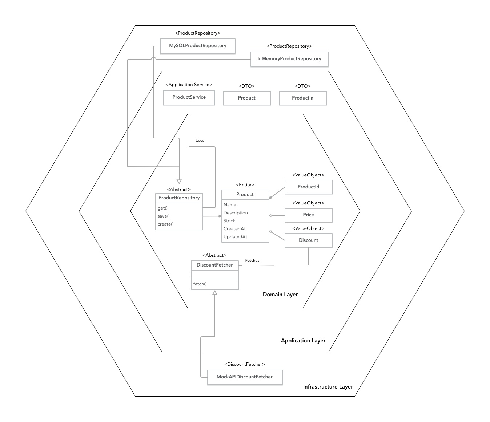
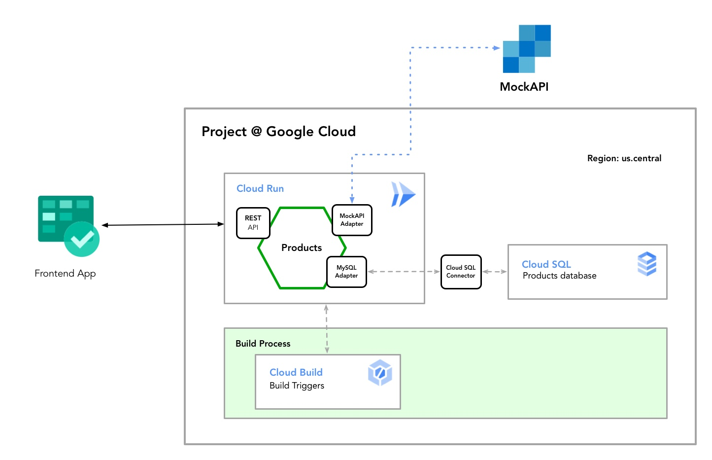
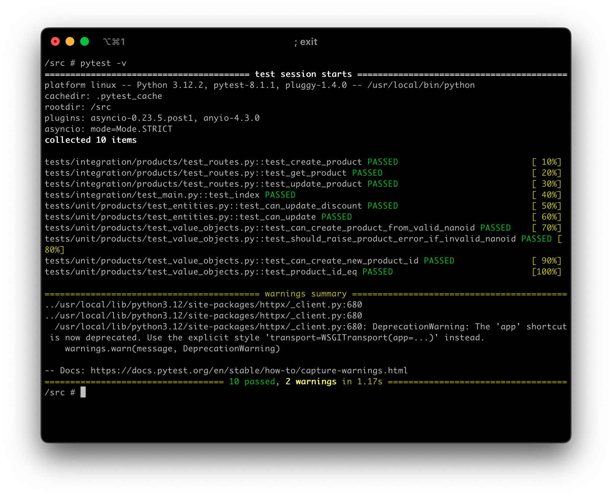

# TektonLabs Products Microservice

A small challenge from Tektonlabs of a products microservice to use as a showcase of clean code patterns, software architecture skills and cloud app development.

It was developed pretty fast using Python 3.12 and a combination of:

- FastAPI(pydantic, uvicorn, sqlachemy, requests, pytest, kink) 
- MySQL database. 
- Lots of caffeine.


## Features

### Software Architecture
- Implemented using **Clean Architecture** (aka Hexagonal, Onion Architecture).
- Domain layer implemented using DDD (Domain Driven Design) Tactical Patterns.
- Strong SOLID Patterns Implementation
- Dependency Injection (using kink)
- TDD approach (integration and units tests are included)
- 100% RESTful API

All the remaining cool acronyms are also included: KISS, DRY, YAGNI :).

### 12-Factor App compliant
- Production ready ```.Dockerfile``` for rapid cloud deployments
- ```docker-compose.yaml``` manifest is included for development environment purposes.
- The required libraries are included in ```requirements.txt```
- ```.env.dev``` file is provided with a development-ready configuration.

### Google Cloud Platform deployment
The service is currently deployed in a GCP project using the following stack: 
- Cloud Build Triggers for the image building process and deployment 
- Cloud Run for a serverless instance (that can be scaled automatically depending on number of requests per second and/or CPU usage)
- Cloud SQL as a SQL database implementation

#### Why Google Cloud?

This approach guarantees that the service does not require any kind of VMs installation and/or configuration, the continuous deployment is handled by a robust service as Cloud Build and also the Cloud Run usage is very cost-efficient.

In addition, GCP provides automatic Cloud Monitoring by default to any Cloud Run instance running.

## Documentation

### OpenAPI 
The OpenAPI (aka Swagger) contract is dinamically generated and can be accesed in http://localhost:8000/docs

### ReDoc
You can also check the pretty auto-generated API documentation in http://localhost:8000/redoc

### Architecture diagram



### Infrastructure diagram

 


## Installation & Execution

Clone the project and execute this command (You need Docker installed in your system):

```bash
$ docker-compose up
```

To test the application, visit the [home page](http://localhost:8000/). You should get the following message:
```json
{
    'title': "This is the products microservice",
    'version': '1.0.0'
}
  
```
    
## Project Structure

Following a pythonic and modular approach the folders (namespaces) are clearly defined to ease the location of each part of the application.
```tree
src
├── docs
│   └── images
├── products
│   ├── application
│   ├── domain
│   └── infrastructure
├── common
└── tests
    ├── integration
    │   └── products
    └── unit
        └── products
```


## Running Tests

To run tests, connect to the running docker container using the command:

```bash
  docker ps
  docker exec -it [CONTAINER_ID] bash
```

Then run the following command in bash

```bash
  pytest -v
```

You should see a result like this



## Author

Rafael Nevarez [@rnevarezc](https://www.github.com/rnevarezc)

